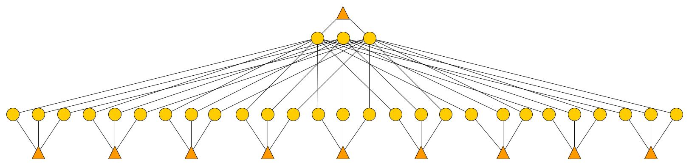
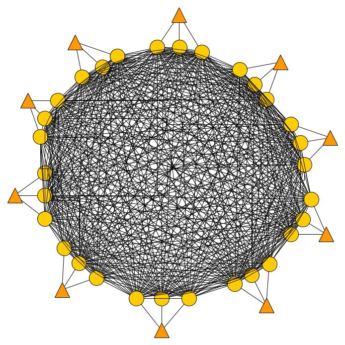

# ICPC_Challenge

This repository contains an instance generator in Python. A shell script can be used to run the generator. 

The generator requires 4 parameters :

- Type of the instance : two network topologies are generated "Type0" or "Type1"
- Number of end nodes : the end points represent the source or a destination of a path. The number of end points must be greater or equal to 2
- Number of tunnels : a tunnel represents a communication between two end nodes. The number of tunnels must be greater or equal to 1
- Number of neighbours : all end nodes have the same number of neighbour nodes. The number of neighbours must be greater or equal to 1.

Examples of the instance types :

Type 0:

  

Type 1:

  

   
The python code can be launch from a terminal as follows

    mkdir InstanceName
    python InstanceGenerator.py TypeTopology NumberEndNodes NumberTunnels NumberNeighbours InstanceName

Example 

    mkdir InstanceName
    python InstanceGenerator.py Type0 10 5 3 nameInstance
  
  
| First Header  | Second Header |
| ------------- | ------------- |
| Content Cell  | Content Cell  |
| Content Cell  | Content Cell  |

128 instances are already generated: 
 
  
| First Header  | Second Header | third Header |
| ------------- | ------------- | ------------- |
|	  Type0_10_5_3	|	  Type0_30_20_4		|	  Type1_20_15_5		|
|	  Type0_10_5_4	|	  Type0_30_20_5		|	  Type1_20_15_6		|
|	  Type0_10_5_5	|	  Type0_30_20_6		|	  Type1_20_20_3		|
|	  Type0_10_5_6	|	  Type0_40_5_3		|	  Type1_20_20_4		|
|	  Type0_10_10_3	|	  Type0_40_5_4		|	  Type1_20_20_5		|
|	  Type0_10_10_4	|	  Type0_40_5_5		|	  Type1_20_20_6		|
|	  Type0_10_10_5	|	  Type0_40_5_6		|	  Type1_30_5_3		|
|	  Type0_10_10_6	|	  Type0_40_10_3		|	  Type1_30_5_4		|
|	  Type0_10_15_3	|	  Type0_40_10_4		|	  Type1_30_5_5		|
|	  Type0_10_15_4	|	  Type0_40_10_5		|	  Type1_30_5_6		|
|	  Type0_10_15_5	|	  Type0_40_10_6		|	  Type1_30_10_3		|
|	  Type0_10_15_6	|	  Type0_40_15_3		|	  Type1_30_10_4		|
|	  Type0_10_20_3	|	  Type0_40_15_4		|	  Type1_30_10_5		|
|	  Type0_10_20_4	|	  Type0_40_15_5		|	  Type1_30_10_6		|
|	  Type0_10_20_5	|	  Type0_40_15_6		|	  Type1_30_15_3		|
|	  Type0_10_20_6	|	  Type0_40_20_3		|	  Type1_30_15_4		|
|	  Type0_20_5_3	|	  Type0_40_20_4		|	  Type1_30_15_5		|
|	  Type0_20_5_4	|	  Type0_40_20_5		|	  Type1_30_15_6		|
|	  Type0_20_5_5	|	  Type0_40_20_6		|	  Type1_30_20_3		|
|	  Type0_20_5_6	|	  Type1_10_5_3		|	  Type1_30_20_4		|
|	  Type0_20_10_3	|	  Type1_10_5_4		|	  Type1_30_20_5		|
|	  Type0_20_10_4	|	  Type1_10_5_5		|	  Type1_30_20_6		|
|	  Type0_20_10_5	|	  Type1_10_5_6		|	  Type1_40_5_3		|
|	  Type0_20_10_6	|	  Type1_10_10_3		|	  Type1_40_5_4		|
|	  Type0_20_15_3	|	  Type1_10_10_4		|	  Type1_40_5_5		|
|	  Type0_20_15_4	|	  Type1_10_10_5		|	  Type1_40_5_6		|
|	  Type0_20_15_5	|	  Type1_10_10_6		|	  Type1_40_10_3		|
|	  Type0_20_15_6	|	  Type1_10_15_3		|	  Type1_40_10_4		|
|	  Type0_20_20_3	|	  Type1_10_15_4		|	  Type1_40_10_5		|
|	  Type0_20_20_4	|	  Type1_10_15_5		|	  Type1_40_10_6		|
|	  Type0_20_20_5	|	  Type1_10_15_6		|	  Type1_40_15_3		|
|	  Type0_20_20_6	|	  Type1_10_20_3		|	  Type1_40_15_4		|
|	  Type0_30_5_3	|	  Type1_10_20_4		|	  Type1_40_15_5		|
|	  Type0_30_5_4	|	  Type1_10_20_5		|	  Type1_40_15_6		|
|	  Type0_30_5_5	|	  Type1_10_20_6		|	  Type1_40_20_3		|
|	  Type0_30_5_6	|	  Type1_20_5_3		|	  Type1_40_20_4		|
|	  Type0_30_10_3	|	  Type1_20_5_4		|	  Type1_40_20_5		|
|	  Type0_30_10_4	|	  Type1_20_5_5		|	  Type1_40_20_6		|
|	  Type0_30_10_5	|	  Type1_20_5_6		|			|
|	  Type0_30_10_6	|	  Type1_20_10_3		|			|
|	  Type0_30_15_3	|	  Type1_20_10_4		|			|
|	  Type0_30_15_4	|	  Type1_20_10_5		|			|
|	  Type0_30_15_5	|	  Type1_20_10_6		|			|
|	  Type0_30_15_6	|	  Type1_20_15_3		|			|
|	  Type0_30_20_3	|	  Type1_20_15_4		|			|

  
  Contact : 
Youcef Magnouche
Email : youcef.magnouche@huawei.com
